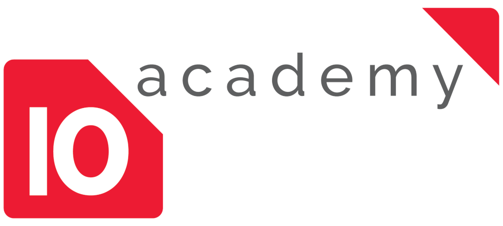

<p align="center">
  <a href="" rel="noopener">
 </a>
</p>

<h3 align="center">Analysis of 10 Academy Student Data on The Moodle LMS</h3>

<div align="center">

[]()
[](https://github.com/kylelobo/The-Documentation-Compendium/issues)
[](https://github.com/kylelobo/The-Documentation-Compendium/pulls)
[](/LICENSE)

</div>

---

<p align="center">Many educational facilities such as colleges, universities, bootcamps rely on scalable and versatile Learning Management Systems. 
The Moodle LMS  is a free and open-source learning management system written in PHP and distributed under the GNU General Public License. It is used for blended learning, distance education, flipped classroom and other e-learning projects in schools, universities, workplaces and other sectors. With customizable management features, it is used to create private websites with online courses for educators and trainers to achieve learning goals. Moodle allows for extending and tailoring learning environments using community-sourced plugins.
In 2019, 10 Academy used the Moodle LMS to manage about 1000 students in their 6 months data science training. Learners, course instructors, and all admins interacted with the Moodle system for almost all the training activities. All events from these activities are logged in the moodle postgres database. 
10 Academy, like any other educational facility, is interested to understand the learners skill and knowledge development, and is interested to build models that are able to predict possible dropouts as well as classify learners into doing, well, doing ok, and struggling groups. 10 Academy is also interested in automating the process of reminding learners approaching deadlines, providing quick feedback based on their overall community engagement and performance. Moreover, given the main goal of 10 Academy training is to make students job ready, it wants to measure students' performance across many relevant metrics. 

    <br> 
</p>

## 📝 Table of Contents

- [About](#about)
- [Getting Started](#getting_started)
- [Usage](#usage)
- [Acknowledgments](#acknowledgement)

## 🧐 About <a name = "about"></a>
Exploration of the 10 Academy Moodle logs stored in the database together with many other relevant tables. This alllows me to illustrate the progress of students across time.The dahboard is created using tableau and it can be found <ahref="#">here</a>

## 🏁 Getting Started <a name = "getting_started"></a>

These instructions will get you a copy of the project up and running on your local machine for development.

### Prerequisites

All the requirements needed to run this project are in the "requirements.txt" file


### Installing

A step by step series of examples that tell you how to get a development env running.

Download and install postgres database if it is not already installed in your computer

This step creates a conda enviroment called "moodle_10Acad"(feel free to use a different enviroment name) in your computer

```
conda create env -n "moodle_10Acad"
```

Install the prerequistes in the enviroment you just created

```
pip install -r requirements.txt
```

## 🎈 Usage <a name="usage"></a>

In the command line create a database named moodle with psql for the user your_user_name

$ sudo -u {your_user_name} createdb moodle

Add the tables from the dump to the local database you just created

$ psql -U tenac -d moodle  -f devmoodle_anonymised.sql

Open and run the "Main.ipynb file using jupyter notebook, ensure to update the engine variable with your username,passowrd and database name"


## 🎉 Acknowledgements <a name = "acknowledgement"></a>

- Inspiration
Thanks to 10Academy

- References
https://docs.moodle.org/39/en/Custom_SQL_queries_report <br>
https://docs.moodle.org/39/en/ad-hoc_contributed_reports <br>
https://citeseerx.ist.psu.edu/viewdoc/download?doi=10.1.1.331.667&rep=rep1&type=pdf <br>
http://informatics.ue-varna.bg/conference19/Conf.proceedings_Informatics-50.years%20177-187.pdf <br>
